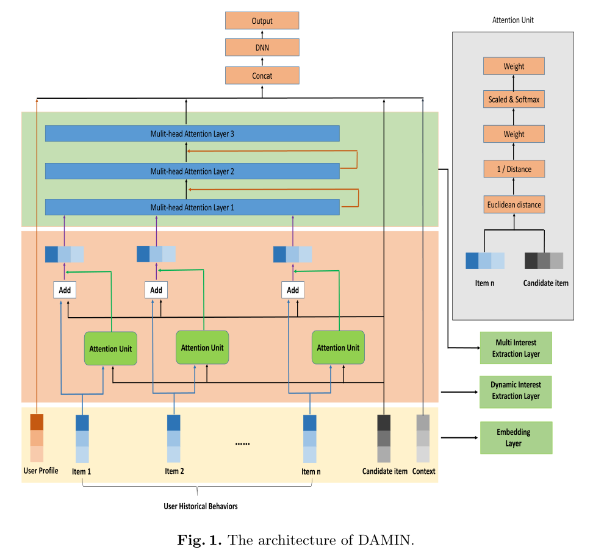
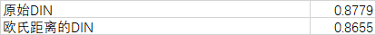
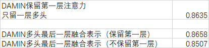

### 1. 论文
Multi-interest Network Based on Double Attention for Click-Through Rate  Prediction

### 2. 模型结构

### 3. 与DIN的主要区别

1. DIN中注意力层返回的维度为[b, d],d为物品的嵌入维度,DAMIN返回的为[b, T, d]作为后续多头注意力的输入。
2. 多头注意力有残差结构，三层多头注意力之后返回[b, T, d]维度数据。

### 4. 实验数据集

采用Amazon数据集中的Electronic子集进行测试。数据集的处理见`preprocess`文件夹和`utils`文件.

### 6. 实验结果

